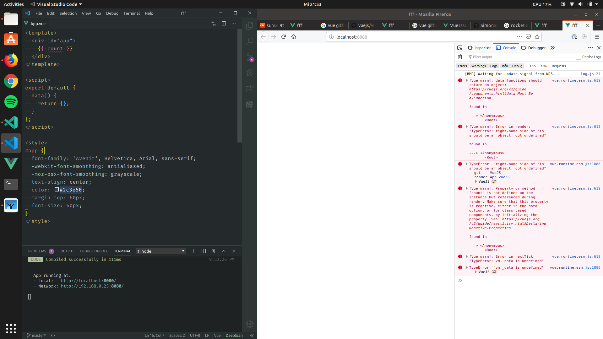

# Vue hot reloading issue

## Quickstart 🚀

```sh
git clone git@github.com:SimonSiefke/vue-hot-reloading-issue.git &&
cd vue-hot-reloading-issue &&
npm ci &&
npm run dev
```

The App looks like this:


## Steps to reproduce

Inside the script section inside `App.vue`, do the following:

1. remove the return inside data


2. return an empty object



3. return the original


## Expected Behaviour

After doing the edits, the App looks as expected since it is the same code as in the first picture.

## Current Behaviour

Hot reloading encounters multiple TypeErrors inside `updateComponent` from Vue and the App cannot recover from its state and doesn't update automatically anymore, it just shows a blank page.

Also, the command line shows `DONE Compiled successfully in 97ms` which suggests that everything is fine.

When the page is reloaded everything works again as expected.
